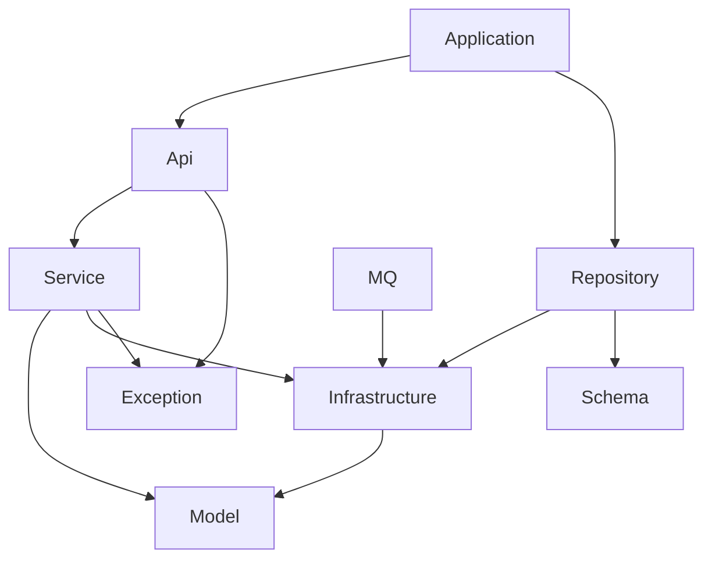
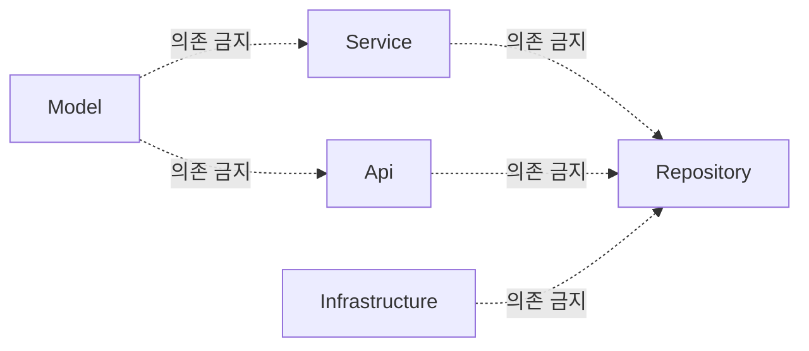

### 의존 규칙

---

## 1. 공통 규칙

- 모든 도메인 모듈은 공통 코드는 `common` 모듈을 통해서만 의존한다.
- 도메인 간 직접 의존은 model -> model 수준에서만 제한적으로 허용한다.
- 구현 기술(JPA, Web, MQ, Batch 등)은 구현 모듈에만 존재한다.
- Core 모듈은 구현 모듈을 절대 의존하지 않는다.
- 예외: 인증/암호화가 필요한 유스케이스는 `common:security` 의존을 허용한다.
- `api` 와 `implementation` 은 다음 의미를 가진다.

    - `api`: 외부 모듈이 타입(계약)을 알아야 함
    - `implementation`: 내부 구현 세부사항

---

## 2. Core 모듈 의존 규칙

### 2.1 model

- 책임

    - 비즈니스 핵심 개념과 규칙
- 의존 가능

    - (필요 시) 다른 도메인의 `model`
- 의존 금지

    - infrastructure / service / api / repository / application

```kotlin
dependencies {
    // 기본적으로 의존 없음
}
```

---

### 2.2 infrastructure (out-port)

- 책임

    - 외부 시스템 연결 규격(Port) 정의
- 의존 가능

    - `{domain}:model`
- 의존 금지

    - repository-*, api, application

```kotlin
dependencies {
    api(project(":{domain}:model"))
}
```

> `api` 사용 이유:
> infrastructure에 정의된 포트 인터페이스의 시그니처에 model 타입이 포함되기 때문

---

### 2.3 service (use-case)

- 책임

    - 유스케이스 단위 비즈니스 로직
    - 트랜잭션 경계
- 의존 가능

    - `{domain}:model`
    - `{domain}:infrastructure`
    - `{domain}:exception`
    - (인증/암호화 필요 시) `common:security`
- 의존 금지

    - repository-*, api, application

```kotlin
dependencies {
    api(project(":{domain}:model"))
    implementation(project(":{domain}:infrastructure"))
    implementation(project(":{domain}:exception"))
}
```

---

### 2.4 exception

- 책임

    - 비즈니스 의미 기반 예외 정의
- 규칙

    - 모든 예외는 `BusinessException`을 상속
- 의존 가능

    - `common:exception`
- 의존 금지

    - Spring / DB / Web 예외 직접 의존

```kotlin
dependencies {
    api(project(":common:exception"))
}
```

---

## 3. 구현(Adapter) 모듈 의존 규칙

### 3.1 api (Inbound Adapter)

- 책임

    - HTTP Controller
    - Request / Response DTO
- 의존 가능

    - `common:api`
    - `{domain}:service`
    - `{domain}:exception`
- 의존 금지

    - repository-*
    - infrastructure 직접 호출

```kotlin
dependencies {
    implementation(project(":common:api"))
    implementation(project(":{domain}:exception"))
    implementation(project(":{domain}:service"))
}
```

---

### 3.2 repository-{type} (Outbound Adapter)

- 책임

    - persistence 포트 구현
    - Entity ↔ Domain 변환
- 의존 가능

    - `common:repository-{type}`
    - `{domain}:infrastructure`
- 의존 금지

    - service / api / application

```kotlin
dependencies {
    implementation(project(":common:repository-{type}"))
    implementation(project(":{domain}:infrastructure"))
}
```

---

### 3.3 application-{type} (Execution / Assembly)

- 책임

    - 실행 가능한 애플리케이션
    - Bean 조립, AutoConfiguration
    - 통합 테스트 환경 구성
- 의존 가능

    - `common:security`
    - `{domain}:api`
    - `{domain}:repository-{type}`
    - `{domain}:schema`
    - `{domain}:mq-rabbitmq` (필요 시)
- 비즈니스 로직 금지

```kotlin
dependencies {
    implementation(project(":common:security"))
    implementation(project(":{domain}:api"))
    implementation(project(":{domain}:repository-{repository-type}"))
    implementation(project(":{domain}:schema"))
    implementation(project(":{domain}:mq-rabbitmq"))
}
```

현재는 aggregate 모듈이 유일하게 application 모듈의 역할을 한다
---

## 4. 의존성 Diagram (Mermaid)

### 4.1 Core ↔ Adapter 의존 구조



---

### 4.2 의존 허용 / 금지 관점 요약



---

## 5. 요약

- model은 아무것도 의존하지 않는다
- service는 계약(infrastructure)만 안다
- repository는 구현이지만 core를 거꾸로 끌어오지 않는다
- api는 orchestration을 하지 않는다
- application은 조립만 한다
- 예외는 항상 BusinessException 계층이다

이 규칙을 지키면,
모듈 수가 늘어나도 의존 방향은 절대 무너지지 않는다.
