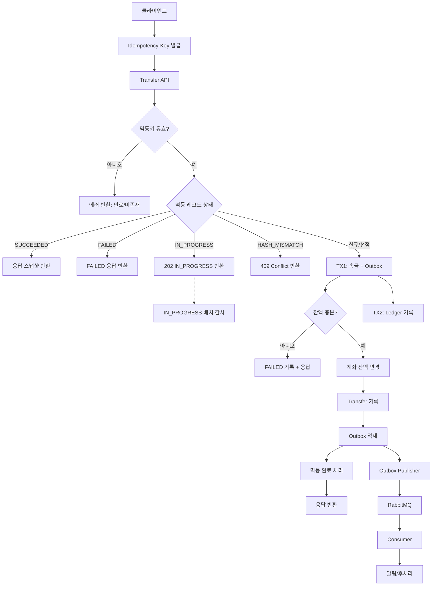

# 계좌 이체 흐름

계좌 이체는 멱등 처리 + outbox 패턴을 사용해
정확히 한 번의 송금과 최소 한 번의 이벤트 발행을 보장한다.



---

## 0. 데이터 모델 전제

도메인 데이터는 `core` 스키마에 두고, 멱등/이벤트 데이터는 `integration` 스키마로 분리한다.

- `core`: `account`, `transfer` 등 도메인 테이블
- `integration`: `idempotency_key`, `outbox_events`, `processed_events`

### `integration.idempotency_key`

- `(client_id, scope, idempotency_key)` UNIQUE
- `status`: `IN_PROGRESS | SUCCEEDED | FAILED`
- `request_hash`
- `response_snapshot` (transferId, status, error_code)
- `started_at`, `completed_at`

#### request_hash 규칙

- canonical JSON
- `{"fromAccountId":<long>,"toAccountId":<long>,"amount":<decimal>}`
- `amount`는 JSON number로 직렬화
- `SHA-256` 해시

---

### `integration.outbox_events`

- `event_id` (BIGINT, PK)
- `aggregate_type`: `TRANSFER`
- `aggregate_id`: transferId
- `event_type`: `TRANSFER_COMPLETED`
- `payload`
- `status`: `NEW | SENT`
- `created_at`

---

## 1. 클라이언트 요청

- `POST /idempotency-keys`로 짧은 수명(예: 10~30분)의 `Idempotency-Key` 발급
- 동일 요청 재시도 시 동일 키 사용
- 요청 바디

```json
{
  "fromAccountId": 1,
  "toAccountId": 2,
  "amount": 10000
}
```

---

## 2. 서버 요청 수신

1. `Idempotency-Key` 존재 및 만료 여부 검증
2. `(client_id, scope, idempotency_key)` 기준으로 멱등 처리 시작

---

## 3. 멱등 레코드 선점 (트랜잭션 A)

### 선점 시도

```sql
UPDATE idempotency_key
SET status       = 'IN_PROGRESS',
    request_hash = ?,
    started_at   = now()
WHERE client_id = ?
  AND scope = ?
  AND idempotency_key = ?
  AND status IS NULL;
```

---

### 기존 레코드 존재 시 처리

#### status = `SUCCEEDED`

- `response_snapshot` 그대로 반환
- 즉시 종료

#### status = `IN_PROGRESS`

- `started_at` 기준 timeout 검사

    - timeout 미초과 → `200 OK`

      ```json
      { "status": "IN_PROGRESS" }
      ```
    - timeout 초과 → 배치 대상 (요청 경로에서 상태 변경하지 않음)

#### status = `FAILED`

- FAILED 응답 그대로 반환
- 같은 멱등키 재시도 금지
- 재시도는 새 멱등키로만 허용

---

### request_hash 불일치

- 동일 멱등키 + 다른 요청 바디
- `409 Conflict`

---

## 4. 송금 처리 (트랜잭션 B)

### 4-1. TX1 (Transfer + Outbox)

1. 계좌 잠금

    - `min(accountId) → max(accountId)` 순서로 row lock
2. 잔액 검증

    - 부족 시 `FAILED`, `error_code = INSUFFICIENT_BALANCE`
3. 잔액 변경

    - from 감소 / to 증가
4. Transfer 기록

    - transferId 생성
    - transfer insert
    - `transferId UNIQUE` (최종 중복 방어)
5. outbox 적재

    - `TRANSFER_COMPLETED`, `status = NEW`
6. 멱등 레코드 완료 처리

    - `status = SUCCEEDED`
    - `response_snapshot` 저장
7. TX1 커밋

    - 실패 시 전체 롤백 + `FAILED`

### 4-2. TX2 (Ledger)

1. 별도 트랜잭션 시작
2. Ledger 기록

    - `(transfer_id, account_id, side)` UNIQUE
3. TX2 커밋

    - 실패 시 TX2만 롤백
    - Transfer는 성공 유지, Ledger는 재시도/보정 대상

---

## 5. 응답 반환

- `200 OK`

```json
{
  "transferId": "...",
  "status": "SUCCEEDED"
}
```

- 응답 전 서버 크래시 발생 시
  → 재요청에서 `response_snapshot`으로 동일 응답 반환

---

## 6. IN_PROGRESS → FAILED 배치(watchdog)

### 목적

- 고아 `IN_PROGRESS` 제거
- 장애 후 정합성 회복

### 동작

- 주기 실행(예: 1분)

```sql
UPDATE idempotency_key
SET status       = 'FAILED',
    completed_at = now(),
    error_code   = 'TIMEOUT'
WHERE status = 'IN_PROGRESS'
  AND started_at < now() - timeout;
```

- @Scheduled 기반 단순 스케줄러 사용
- 멀티 인스턴스에서도 안전 (멱등 UPDATE)

---

## 7. outbox publisher

```sql
SELECT *
FROM outbox_events
WHERE status = 'NEW'
ORDER BY created_at
    FOR
UPDATE SKIP LOCKED
    LIMIT N;
```

- publish 성공 → `SENT`
- 실패 → 상태 유지 + backoff
- 중복 발행 가능(정상)

---

## 8. RabbitMQ consumer

1. `event_id` 기준 처리 이력 조회
2. 이미 처리됨 → ACK
3. 최초 처리

    - 알림 / 정산 / 후처리
    - 처리 이력 기록
    - ACK
4. 중간 실패

    - ACK 안 함
    - 재전달은 멱등 소비로 흡수

---

## 9. observability

### 로그 키

- `idempotency_key`
- `transferId`
- `event_id`

### 메트릭

- IN_PROGRESS 체류 시간
- FAILED 비율
- outbox backlog 크기

---

## 10. integration 스키마(DDL)

### 10-1. idempotency_key

```sql
CREATE TABLE integration.idempotency_key
(
    idempotency_key_id BIGINT AUTO_INCREMENT PRIMARY KEY,
    client_id          BIGINT      NOT NULL,
    scope              VARCHAR(50) NOT NULL,
    idempotency_key    CHAR(36)    NOT NULL,
    status             VARCHAR(20) NULL,
    request_hash       CHAR(64)    NULL,
    response_snapshot  JSON        NULL,
    started_at         DATETIME(6) NULL,
    completed_at       DATETIME(6) NULL,
    expires_at         DATETIME(6) NOT NULL,
    UNIQUE KEY uk_idempotency_key (client_id, scope, idempotency_key),
    KEY idx_idempotency_key_status_started_at (status, started_at),
    KEY idx_idempotency_key_expires_at (expires_at)
);
```

### 10-2. outbox_events

```sql
CREATE TABLE integration.outbox_events
(
    event_id       CHAR(36) PRIMARY KEY,
    aggregate_type VARCHAR(50)  NOT NULL,
    aggregate_id   VARCHAR(50)  NOT NULL,
    event_type     VARCHAR(100) NOT NULL,
    payload        JSON         NOT NULL,
    status         VARCHAR(20)  NOT NULL,
    created_at     DATETIME(6)  NOT NULL,
    KEY idx_outbox_events_status_created_at (status, created_at)
);
```
